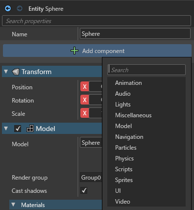
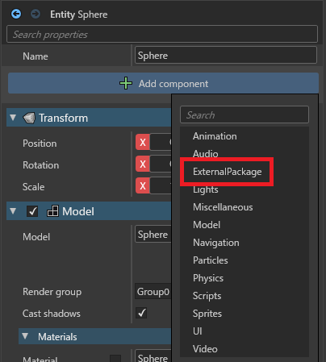

# Overview

This repository tests [Stride](https://www.stride3d.net) external package reference problem test.
**This is tested on Stride-4.2.0.2067**

# Problem

If There is NuGet package which has custom component and add nuget refs to project,
custom component is not displayed in Stride editor's component list.

# Projects

## ExternalPacakge1

The Stride library project which has custom component for using other projects.

## RefByProject

The Stride game project which has `ProjectReference` to ExternalPackage1

## RefByNuPkg

The Stride game project which has `PackageReference` to ExternalPackage1

# Usage for test

1. install Cake.Tool with `dotnet tool install -g Cake.Tool`
2. do `dotnet cake build.cake --configuration Release` in top directory of repo
    * then `nupkg/ExternalPackage1.[PackageVersion].nupkg` will be created
3. open "ExternalPacakge1/ExternalPackage1.sln" for test "RefByProject" with Stride editor
4. open "RefByNuPkg/RefByNuPkg.sln" for test "RefByNuPkg" with Stride editor
5. select any entity in project and open dropdown list which named "Add component" in right side of editor

## ref by nupkg

## ref by project

